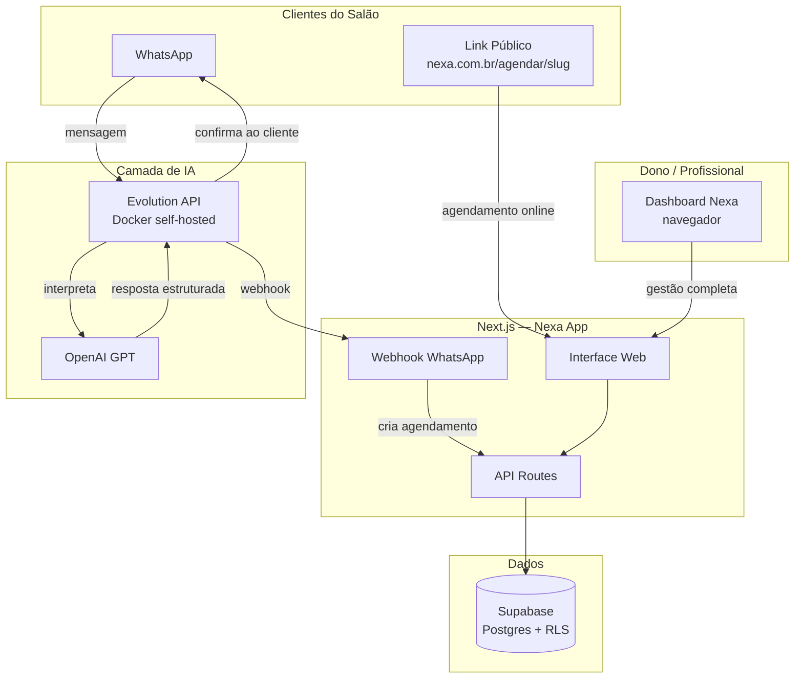
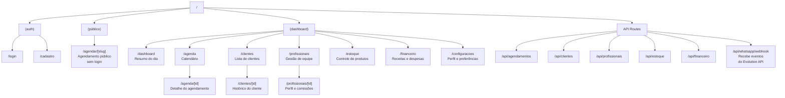
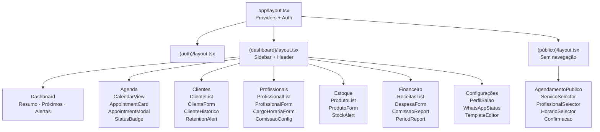
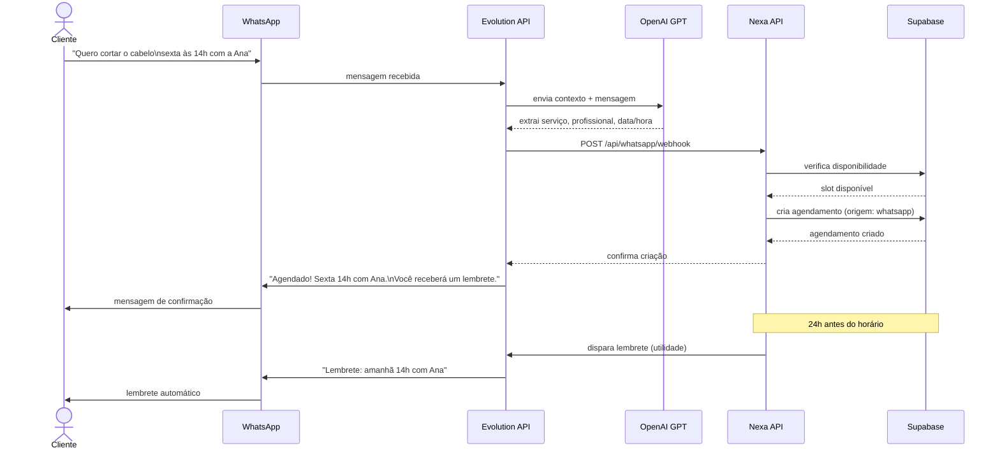
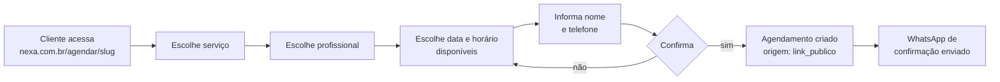
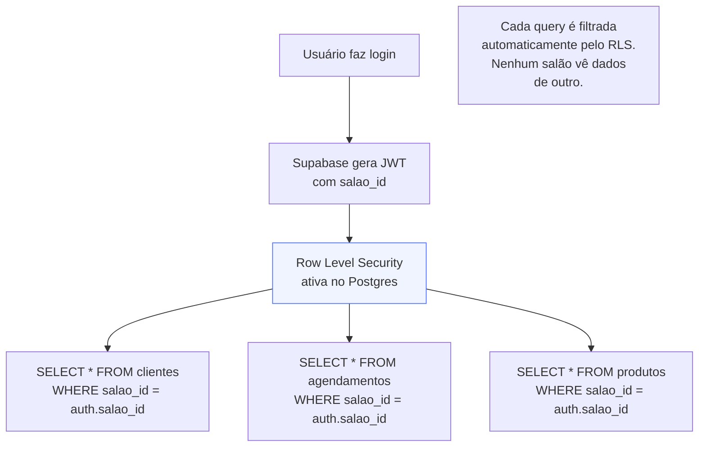
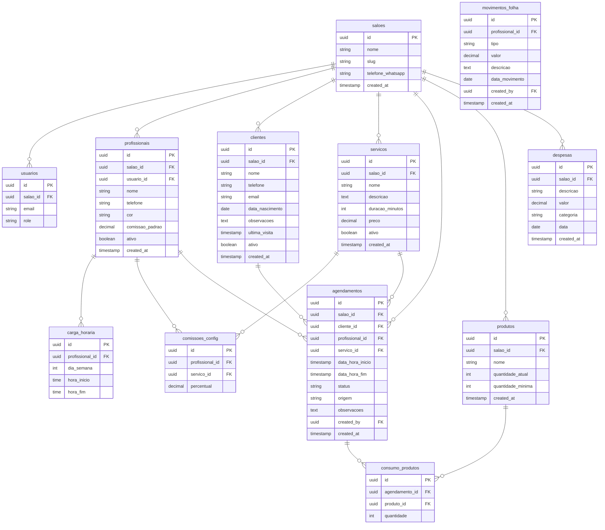

# Diagrama do Sistema — Nexa

> Mapa completo da arquitetura. Atualizado a cada mudança estrutural.
> Visualize com `Ctrl+Shift+V` no VS Code (extensão: Markdown Preview Mermaid Support).

---

## 1. Visão Geral do Sistema

---

## 2. Rotas do App (Next.js App Router)

---

## 3. Árvore de Componentes

---

## 4. Fluxo WhatsApp com IA

---

## 5. Fluxo de Agendamento Público

---

## 6. Multi-tenant — Isolamento de Dados

---

## 7. Schema do Banco de Dados

---

## Legenda

| Símbolo | Significado |
|---------|-------------|
| `PK` | Chave primária |
| `FK` | Chave estrangeira |
| `RLS` | Row Level Security — isolamento automático por salão |
| `slug` | Identificador único do salão na URL pública |
| `origem` | `manual` · `whatsapp` · `link_publico` |
| `status` | `agendado` · `confirmado` · `concluido` · `cancelado` · `falta` |
| `role` | `dono` · `profissional` |
